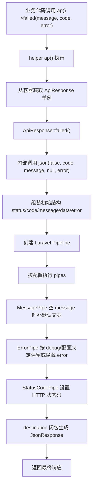
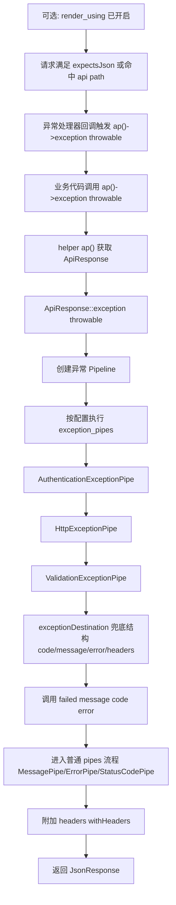

# API 响应使用说明

本文档说明 `laravel-helper` 中 API 响应模块的用法，包括 `ap()`、`Ap` Facade、异常接管、快捷状态方法和可扩展配置。

业务接入示例请查看：[`api-response-examples.md`](api-response-examples.md)
前后端约定模板请查看：[`api-response-contract-template.md`](api-response-contract-template.md)
项目扩展指南请查看：[`api-response-project-extension.md`](api-response-project-extension.md)
前端判定规则请查看：[`api-response-frontend-quick.md`](api-response-frontend-quick.md)
升级说明请查看：[`api-response-upgrade.md`](api-response-upgrade.md)
性能压测请查看：[`api-response-benchmark.md`](api-response-benchmark.md)
生产配置模板请查看：[`api-response-production-template.md`](api-response-production-template.md)

## 1. 快速开始

安装后（并确保服务提供者已注册），你可以直接使用全局方法：

```php
ap()->ok(['id' => 1], 'ok');
ap()->success(['id' => 1], 'success');
ap()->message('created', 201, ['id' => 1]);
ap()->failed('bad request', 400, ['field' => 'name']);
ap()->debug(['query' => 'select 1'], 'debug message');
ap()->exception(new \Exception('boom'));
```

也可以使用 Facade：

```php
\FeloZ\LaravelHelper\Facades\Ap::ok(['id' => 1], 'ok');
```

## 2. 响应结构

默认返回结构：

```json
{
  "status": true,
  "code": 200,
  "message": "OK",
  "data": {},
  "error": {}
}
```

说明：

- `status`: 业务状态（`true/false`）
- `code`: 业务/HTTP 状态码
- `message`: 文案消息
- `data`: 成功数据
- `error`: 错误详情（可按配置隐藏）

## 3. 核心方法

- `ok($data = null, $message = '')`
- `success($data = null, $message = '', $code = 200)`
- `message($message, $code = 200, $data = null)`
- `failed($message = '', $code = 400, ?array $error = null)`
- `error($message = '', $code = 400, ?array $error = null)`（`failed` 别名）
- `debug($payload = null, $message = '', $code = 500)`
- `exception(Throwable $throwable)`
- `json(bool|int|string $status, int $code, string $message = '', mixed $data = null, ?array $error = null)`

常用 `code` 也可直接引用包内常量：`FeloZ\LaravelHelper\Support\ApiCode`（兼容入口）。  
新项目建议优先使用分组常量：`FeloZ\LaravelHelper\Support\ApiCodes\*`

方法场景对照（建议）：

| 方法 | 主要场景 | 说明 |
| --- | --- | --- |
| `ok($data, $message)` | 常规查询成功 | 固定 200 |
| `created($data, $message, $location)` | 创建成功 | 201，可带 `Location` |
| `accepted($data, $message)` | 异步受理 | 202 |
| `success($data, $message, $code)` | 通用成功 | 可自定义成功码 |
| `message($message, $code, $data)` | 文案优先成功 | 参数顺序更偏提示语 |
| `failed($message, $code, $error)` | 通用失败 | 推荐主入口 |
| `error($message, $code, $error)` | 通用失败 | `failed` 别名 |
| `exception($throwable)` | 异常转统一响应 | 走 `exception_pipes` |

## 4. HTTP 快捷方法

### 4.1 成功态

- `ok()` -> 200
- `created()` -> 201（支持 `Location` 头）
- `accepted()` -> 202
- `nonAuthoritativeInformation()` -> 203
- `noContent()` -> 204
- `resetContent()` -> 205
- `partialContent()` -> 206
- `multiStatus()` -> 207
- `alreadyReported()` -> 208
- `imUsed()` -> 226

### 4.2 错误态

- `badRequest()` -> 400
- `unauthorized()` -> 401
- `paymentRequired()` -> 402
- `forbidden()` -> 403
- `notFound()` -> 404
- `methodNotAllowed()` -> 405
- `notAcceptable()` -> 406
- `proxyAuthenticationRequired()` -> 407
- `requestTimeout()` -> 408
- `conflict()` -> 409
- `gone()` -> 410
- `lengthRequired()` -> 411
- `preconditionFailed()` -> 412
- `requestEntityTooLarge()` -> 413
- `requestUriTooLong()` -> 414
- `unsupportedMediaType()` -> 415
- `requestedRangeNotSatisfiable()` -> 416
- `expectationFailed()` -> 417
- `iAmATeapot()` -> 418
- `misdirectedRequest()` -> 421
- `unprocessableEntity()` -> 422
- `locked()` -> 423
- `failedDependency()` -> 424
- `tooEarly()` -> 425
- `upgradeRequired()` -> 426
- `preconditionRequired()` -> 428
- `tooManyRequests()` -> 429
- `requestHeaderFieldsTooLarge()` -> 431
- `unavailableForLegalReasons()` -> 451
- `internalServerError()` -> 500

## 5. 异常自动接管（render using）

当开启 `api_response.enable_render_using` 时，异常会在以下请求中自动转为 API JSON 响应：

- `expectsJson()` 为 `true`
- 或请求路径命中 `api_response.render_api_paths`（默认 `api/*`）

默认策略类：

- `FeloZ\LaravelHelper\Support\RenderUsings\ShouldReturnJsonRenderUsing`

## 6. 配置说明

发布配置后，在 `config/felo-helper.php` 中调整：

```php
'api_response' => [
    'enable_render_using' => env('FELO_HELPER_API_ENABLE_RENDER_USING', true),
    'render_using' => \FeloZ\LaravelHelper\Support\RenderUsings\ShouldReturnJsonRenderUsing::class,
    'render_api_paths' => ['api/*'],
    'status_code_strategy' => env('FELO_HELPER_API_STATUS_CODE_STRATEGY', 'smart'),
    'hide_error_when_not_debug' => env('FELO_HELPER_API_HIDE_ERROR', true),
    'pipes' => [
        \FeloZ\LaravelHelper\Support\Pipes\MessagePipe::class,
        \FeloZ\LaravelHelper\Support\Pipes\ErrorPipe::class,
        \FeloZ\LaravelHelper\Support\Pipes\StatusCodePipe::class,
    ],
    'exception_pipes' => [
        \FeloZ\LaravelHelper\Support\ExceptionPipes\AuthenticationExceptionPipe::class,
        \FeloZ\LaravelHelper\Support\ExceptionPipes\HttpExceptionPipe::class,
        \FeloZ\LaravelHelper\Support\ExceptionPipes\ValidationExceptionPipe::class,
    ],
],
```

`status_code_strategy` 说明：

- `smart`（默认）：当 `code` 不是 HTTP 状态码（例如业务码 `200404`）时，失败响应 HTTP 状态默认为 `400`
- `legacy`：保持旧行为，失败响应 HTTP 状态默认为 `500`

## 7. Pipe 扩展示例

你可以通过配置追加自定义 pipe。

### 7.1 自定义响应 pipe

```php
namespace App\Support\ApiResponse\Pipes;

use Closure;
use Illuminate\Http\JsonResponse;

class TraceIdPipe
{
    public function handle(array $structure, Closure $next): JsonResponse
    {
        $response = $next($structure);
        $response->headers->set('X-Trace-Id', request()->header('X-Trace-Id', uniqid('trace_', true)));
        return $response;
    }
}
```

然后注册到 `api_response.pipes`。

### 7.2 自定义异常 pipe

```php
namespace App\Support\ApiResponse\ExceptionPipes;

use Closure;
use Throwable;

class DomainExceptionPipe
{
    public function handle(Throwable $throwable, Closure $next): array
    {
        $structure = $next($throwable);

        if ($throwable instanceof \DomainException) {
            return [
                'code' => 422,
                'message' => $throwable->getMessage(),
                'error' => ['type' => 'domain_exception'],
            ] + $structure;
        }

        return $structure;
    }
}
```

然后注册到 `api_response.exception_pipes`。

## 8. 使用建议

- 业务代码优先使用快捷方法（如 `ok()`、`failed()`、`notFound()`），避免手写状态码。
- 统一错误输出建议走 `exception()` 或直接抛异常并交给 render using。
- 生产环境建议保留 `hide_error_when_not_debug = true`，避免泄露堆栈信息。
- 对外 API 建议固定使用 `api/*` 前缀，便于异常接管策略统一生效。

## 9. 执行流程图

### 9.1 `ap()->failed()` 流程



### 9.2 `ap()->exception()` 流程


